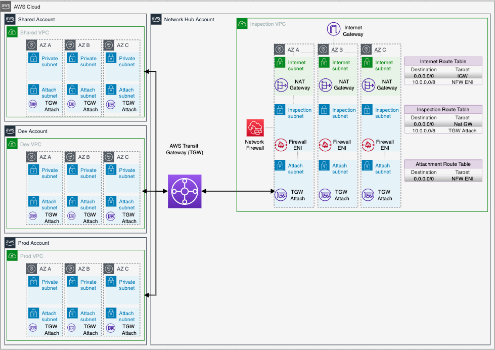
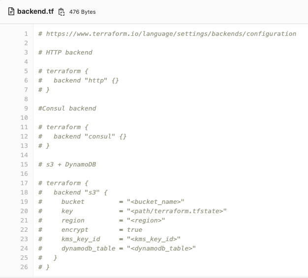
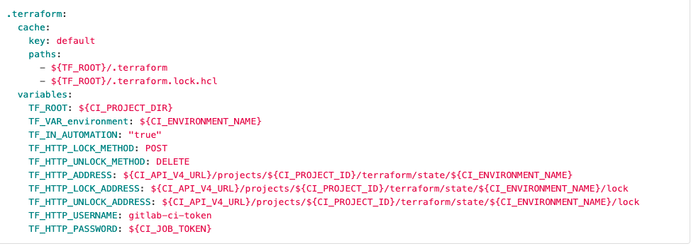

<!-- markdownlint-disable MD033 MD024 MD001 -->
# Network Spoke Account with Terraform

## Overview

This example demonstrates a matching spoke VPC that is **consistent, cost efficient and automatable** to join to the example hub account to consume centralised network services.

* Consistent: allows reasoning about all of your AWS organization's network state
* Cost efficient: Removes requirement for per-VPC NAT Gateway and VPC Endpoints
* Automatable: Simple VPC deployment can be tied in to other processes such as account creation automation.

The following resources will be deployed by this example:

* a VPC with a CIDR assigned by AWS VPC IP Address Manager
* 3 Endpoint Subnets
* 3 Private Subnets
* Local VPC Endpoints
* TGW Attachment, Association and Propagation
* Route 53 Resolver Rule Association
* Private Hosted Zone

The resources deployed and the architectural pattern they follow are provided for demonstration and
testing purposes but are based on and inspired by AWS best practice and articles.

## Table of Contents

* [Overview](#overview)
  * [Diagrams](#diagrams)
  * [Useful Links](#useful-links)
* [Prerequisites](#prerequisites)
* [Quick Start](#quick-start)
  * [Deploy from client machine](#deploy-from-client-machine)
  * [Validate Deployment](#validate-deployment)
  * [Tagging](#tagging)
  * [clean Up](#clean-up)
* [Terraform Docs](#terraform-docs)

### Diagrams

Solution Diagram


Transit Gateway


VPC Endpoints


Network Firewall


Route 53 Resolver


### Useful Links

* <https://aws.amazon.com/blogs/architecture/field-notes-how-to-scale-your-networks-on-amazon-web-services/>
* <https://aws.amazon.com/blogs/industries/defining-an-aws-multi-account-strategy-for-a-digital-bank/>
* <https://aws.amazon.com/blogs/security/protect-your-remote-workforce-by-using-a-managed-dns-firewall-and-network-firewall/>
* <https://aws.amazon.com/blogs/architecture/field-notes-working-with-route-tables-in-aws-transit-gateway/>
* <https://docs.aws.amazon.com/vpc/latest/tgw/transit-gateway-isolated-shared.html>
* <https://aws.amazon.com/blogs/security/simplify-dns-management-in-a-multiaccount-environment-with-route-53-resolver/>

-----------------------------------------------------------

## Prerequisites

### Tooling

* Terraform ~> 1.1
  * AWS provider ~> 3.0
* AWS CLI
* Git CLI

### Infrastructure

* AWS Organization
  * RAM enabled to Org
  * IPAM delegated to network hub account
* Centralised network account with [Hub Solution](https://gitlab.aws.dev/aandsco/network-hub-terraform) deployed
* Spoke account to deploy into
* IAM role with required permissions
  * **Tag all roles with automation = true**


**Customisation**
If you do not define a remote backend Terraform will use the local directory to store the local backend files including tfstate. Examples of how to customise the Terraform backend are included but commented out.

 

Example GitLab HTTP backend for use with GitLab CI.

 

Update network hub account ID in **config.auto.tfvars** per environment.

 ```terraform
aws_region                = "eu-west-2"
vpc_endpoints             = ["s3"]
centralised_vpc_endpoints = ["ec2", "rds", "sqs", "sns", "ssm", "logs", "ssmmessages", "ec2messages", "autoscaling", "ecs", "athena"]

env_config = {
  dev = {
    network_hub_account_number = "<Network_Hub_Account_ID>"
    tgw_route_tables           = ["shared", "dev"]
    root_domain                = "network-dev.internal."
  }
  test = {
    network_hub_account_number = "<Network_Hub_Account_ID>"
    tgw_route_tables           = ["shared", "dev"]
    root_domain                = "network-test.internal."
  }
  preprod = {
    network_hub_account_number = "<Network_Hub_Account_ID>"
    tgw_route_tables           = ["shared", "dev"]
    root_domain                = "network-preprod.internal."
  }
  prod = {
    network_hub_account_number = "<Network_Hub_Account_ID>"
    tgw_route_tables           = ["shared", "prod"]
    root_domain                = "network-prod.internal."
  }
}
 ```

-----------------------------------------------------------

## Quick Start

### Deploy from client machine

When deploying from your local machine having configured the **TF Backend** in the code you need to ensure you have access to read and write to the backend - possible backends include HTTP, Consul, Postgres, Artifactory, S3 or S3 + DynamoDB. We initialise the Terraform, complete the validate and format. Review the plan and then apply.

* ``` terraform init ```
* ``` terraform validate ```
* set environment for deployment
  * ``` export TF_VAR_environment=" **ENV** " ```
  * ``` Set-Item -Path env:TF_VAR_environment -Value “ **ENV** “ ```
      (Possible Env values * dev, test, preprod, prod)
* ``` terraform plan ```
* ``` terraform apply ``` **or** ``` terraform apply --auto-approve ```

-----------------------------------------------------------

### Tagging

Tags are added to all AWS resources through use of the tag configuration of the AWS Provider.

As not all AWS resources support default tags passed from the provider (EC2 Auto-Scaling Group + Launch Template)
We pass the tags as a variable (Map(string) - these are defined in the root locals.tf file.


**Example Tags -** *locals.tf*

```terraform
tags = {
  Product    = "Network_Automation"
  Owner      = "GitHub"
  Project_ID = "12345"
}
```

### Clean Up

Remember to clean up after your work is complete. You can do that by doing `terraform destroy`.

Note that this command will delete all the resources previously created by Terraform.

## Terraform Docs

<!-- BEGIN_TF_DOCS -->

#### Requirements

| Name | Version |
|------|---------|
| terraform | ~> 1.1 |
| aws | ~> 3.0 |

#### Providers

| Name | Version |
|------|---------|
| aws | ~> 3.0 |
| aws.network_hub | ~> 3.0 |

#### Modules

| Name | Source | Version |
|------|--------|---------|
| dns | ./modules/dns | n/a |
| network | ./modules/network | n/a |

#### Resources

| Name | Type |
|------|------|
| [aws_availability_zones.available](https://registry.terraform.io/providers/hashicorp/aws/latest/docs/data-sources/availability_zones) | data source |
| [aws_ec2_transit_gateway.org_env](https://registry.terraform.io/providers/hashicorp/aws/latest/docs/data-sources/ec2_transit_gateway) | data source |
| [aws_ec2_transit_gateway_route_table.associate](https://registry.terraform.io/providers/hashicorp/aws/latest/docs/data-sources/ec2_transit_gateway_route_table) | data source |
| [aws_ec2_transit_gateway_route_table.org_env](https://registry.terraform.io/providers/hashicorp/aws/latest/docs/data-sources/ec2_transit_gateway_route_table) | data source |

#### Inputs

| Name | Description | Type | Default | Required |
|------|-------------|------|---------|:--------:|
| aws_region | AWS region being deployed to | `string` | n/a | yes |
| az_count | Number of availability zones | `number` | `2` | no |
| centralised_vpc_endpoints | Which centralised VPC endpoints to consume | `list(string)` | n/a | yes |
| env_config | Map of objects for per environment configuration | <pre>map(object({<br>    network_hub_account_number = string<br>    tgw_route_tables           = list(string)<br>    root_domain                = string<br>  }))</pre> | n/a | yes |
| environment | Deployment environment passed as argument or environment variable | `string` | n/a | yes |
| tags | Default tags to apply to all resources | `map(string)` | n/a | yes |
| vpc_endpoints | Which local VPC endpoints to deploy | `list(string)` | n/a | yes |
| vpc_name | Name of the VPC | `string` | `"spoke"` | no |

#### Outputs

| Name | Description |
|------|-------------|
| vpc_id | VPC ID used for other modules |

<!-- END_TF_DOCS -->

<!-- BEGIN_TF_Network_DOCS -->

#### Requirements

| Name | Version |
|------|---------|
| terraform | ~> 1.1 |
| aws | ~> 3.0 |

#### Providers

| Name | Version |
|------|---------|
| aws | ~> 3.0 |
| aws.network_hub | ~> 3.0 |

#### Modules

No modules.

#### Resources

| Name | Type |
|------|------|
| [aws_cloudwatch_log_group.flow_logs](https://registry.terraform.io/providers/hashicorp/aws/latest/docs/resources/cloudwatch_log_group) | resource |
| [aws_default_security_group.default](https://registry.terraform.io/providers/hashicorp/aws/latest/docs/resources/default_security_group) | resource |
| [aws_ec2_transit_gateway_route_table_association.env](https://registry.terraform.io/providers/hashicorp/aws/latest/docs/resources/ec2_transit_gateway_route_table_association) | resource |
| [aws_ec2_transit_gateway_route_table_propagation.org](https://registry.terraform.io/providers/hashicorp/aws/latest/docs/resources/ec2_transit_gateway_route_table_propagation) | resource |
| [aws_ec2_transit_gateway_vpc_attachment.vpc_endpoint](https://registry.terraform.io/providers/hashicorp/aws/latest/docs/resources/ec2_transit_gateway_vpc_attachment) | resource |
| [aws_egress_only_internet_gateway.spoke_vpc](https://registry.terraform.io/providers/hashicorp/aws/latest/docs/resources/egress_only_internet_gateway) | resource |
| [aws_flow_log.vpc](https://registry.terraform.io/providers/hashicorp/aws/latest/docs/resources/flow_log) | resource |
| [aws_iam_role.flow_logs](https://registry.terraform.io/providers/hashicorp/aws/latest/docs/resources/iam_role) | resource |
| [aws_iam_role_policy.flow_logs](https://registry.terraform.io/providers/hashicorp/aws/latest/docs/resources/iam_role_policy) | resource |
| [aws_kms_key.log_key](https://registry.terraform.io/providers/hashicorp/aws/latest/docs/resources/kms_key) | resource |
| [aws_route.default_route](https://registry.terraform.io/providers/hashicorp/aws/latest/docs/resources/route) | resource |
| [aws_route.default_route_ipv6](https://registry.terraform.io/providers/hashicorp/aws/latest/docs/resources/route) | resource |
| [aws_route53_record.dev-ns](https://registry.terraform.io/providers/hashicorp/aws/latest/docs/resources/route53_record) | resource |
| [aws_route53_zone.interface_phz](https://registry.terraform.io/providers/hashicorp/aws/latest/docs/resources/route53_zone) | resource |
| [aws_route_table.spoke_vpc](https://registry.terraform.io/providers/hashicorp/aws/latest/docs/resources/route_table) | resource |
| [aws_route_table_association.app_subnet](https://registry.terraform.io/providers/hashicorp/aws/latest/docs/resources/route_table_association) | resource |
| [aws_route_table_association.endpoint_subnet](https://registry.terraform.io/providers/hashicorp/aws/latest/docs/resources/route_table_association) | resource |
| [aws_security_group.allow_vpc_endpoint](https://registry.terraform.io/providers/hashicorp/aws/latest/docs/resources/security_group) | resource |
| [aws_security_group_rule.local_cidr](https://registry.terraform.io/providers/hashicorp/aws/latest/docs/resources/security_group_rule) | resource |
| [aws_subnet.app_subnet](https://registry.terraform.io/providers/hashicorp/aws/latest/docs/resources/subnet) | resource |
| [aws_subnet.endpoint_subnet](https://registry.terraform.io/providers/hashicorp/aws/latest/docs/resources/subnet) | resource |
| [aws_vpc.spoke_vpc](https://registry.terraform.io/providers/hashicorp/aws/latest/docs/resources/vpc) | resource |
| [aws_vpc_dhcp_options.spoke_vpc](https://registry.terraform.io/providers/hashicorp/aws/latest/docs/resources/vpc_dhcp_options) | resource |
| [aws_vpc_dhcp_options_association.spoke_vpc](https://registry.terraform.io/providers/hashicorp/aws/latest/docs/resources/vpc_dhcp_options_association) | resource |
| [aws_vpc_endpoint.interface](https://registry.terraform.io/providers/hashicorp/aws/latest/docs/resources/vpc_endpoint) | resource |
| [aws_caller_identity.current](https://registry.terraform.io/providers/hashicorp/aws/latest/docs/data-sources/caller_identity) | data source |
| [aws_iam_policy_document.policy_kms_logs_document](https://registry.terraform.io/providers/hashicorp/aws/latest/docs/data-sources/iam_policy_document) | data source |
| [aws_ssm_parameter.ipam_pool](https://registry.terraform.io/providers/hashicorp/aws/latest/docs/data-sources/ssm_parameter) | data source |

#### Inputs

| Name | Description | Type | Default | Required |
|------|-------------|------|---------|:--------:|
| aws_region | AWS region being deployed to | `string` | n/a | yes |
| az_names | A list of the Availability Zone names available to the account | `list(string)` | n/a | yes |
| environment | Deployment environment passed as argument or environment variable | `string` | n/a | yes |
| interface_endpoints | Object representing the region and services to create interface endpoints for | `map(string)` | n/a | yes |
| network_hub_account_number | Network Hub account ID | `string` | n/a | yes |
| tgw | TGW ID for VPC attachments | `string` | n/a | yes |
| tgw_association | TGW route table to associate to | `string` | n/a | yes |
| tgw_route_table | TGW route tables for VPC association and propagation | `map(string)` | n/a | yes |
| vpc_name | Name of the VPC | `string` | `"spoke"` | no |

#### Outputs

| Name | Description |
|------|-------------|
| vpc_id | VPC ID used for other modules |

<!-- END_TF_Network_DOCS -->

<!-- BEGIN_TF_DNS_DOCS -->

#### Requirements

| Name | Version |
|------|---------|
| terraform | ~> 1.1 |
| aws | ~> 3.0 |

#### Providers

| Name | Version |
|------|---------|
| aws | ~> 3.0 |
| aws.network_hub | ~> 3.0 |

#### Modules

No modules.

#### Resources

| Name | Type |
|------|------|
| [aws_route53_record.ns_record](https://registry.terraform.io/providers/hashicorp/aws/latest/docs/resources/route53_record) | resource |
| [aws_route53_resolver_rule_association.root_domain](https://registry.terraform.io/providers/hashicorp/aws/latest/docs/resources/route53_resolver_rule_association) | resource |
| [aws_route53_vpc_association_authorization.delegated_private](https://registry.terraform.io/providers/hashicorp/aws/latest/docs/resources/route53_vpc_association_authorization) | resource |
| [aws_route53_vpc_association_authorization.endpoint_phz](https://registry.terraform.io/providers/hashicorp/aws/latest/docs/resources/route53_vpc_association_authorization) | resource |
| [aws_route53_zone.delegated_private](https://registry.terraform.io/providers/hashicorp/aws/latest/docs/resources/route53_zone) | resource |
| [aws_route53_zone_association.delegated_private](https://registry.terraform.io/providers/hashicorp/aws/latest/docs/resources/route53_zone_association) | resource |
| [aws_route53_zone_association.endpoint_phz](https://registry.terraform.io/providers/hashicorp/aws/latest/docs/resources/route53_zone_association) | resource |
| [aws_caller_identity.current](https://registry.terraform.io/providers/hashicorp/aws/latest/docs/data-sources/caller_identity) | data source |
| [aws_route53_resolver_rule.root_domain](https://registry.terraform.io/providers/hashicorp/aws/latest/docs/data-sources/route53_resolver_rule) | data source |
| [aws_route53_zone.centralised_endpoints](https://registry.terraform.io/providers/hashicorp/aws/latest/docs/data-sources/route53_zone) | data source |
| [aws_route53_zone.selected](https://registry.terraform.io/providers/hashicorp/aws/latest/docs/data-sources/route53_zone) | data source |
| [aws_vpc.endpoint](https://registry.terraform.io/providers/hashicorp/aws/latest/docs/data-sources/vpc) | data source |
| [aws_vpc.selected](https://registry.terraform.io/providers/hashicorp/aws/latest/docs/data-sources/vpc) | data source |

#### Inputs

| Name | Description | Type | Default | Required |
|------|-------------|------|---------|:--------:|
| aws_region | AWS region being deployed to | `string` | n/a | yes |
| centralised_vpc_endpoints | Which centralised VPC endpoints to consume | `map(string)` | n/a | yes |
| environment | Deployment environment passed as argument or environment variable | `string` | n/a | yes |
| network_hub_account_number | Network Hub account ID | `string` | n/a | yes |
| root_domain | Root domain for the delegated private hosted zone | `string` | n/a | yes |
| vpc_id | VPC ID to associate delegated subdomain to | `string` | n/a | yes |

#### Outputs

No outputs.

<!-- END_TF_DNS_DOCS -->